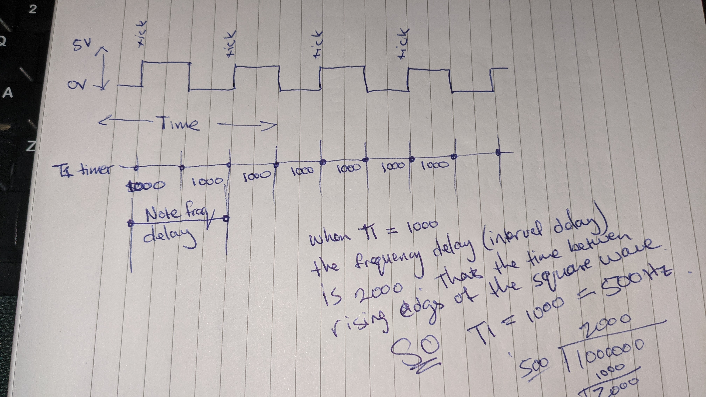

# Programming music on a homebrew 6502 using assembly

Video Link: https://www.reddit.com/r/beneater/comments/pm4u34/further_fun_with_buzzers/

This project shows how I was able to generate some rudimentary music on the Ben Eater 6502  - https://eater.net/6502

The photos I include in this writeup also show an Arduino Nano on the board.  That's because I am using the Sixty5o2 Mini OS from https://github.com/janroesner/sixty5o2.  If you've not seen it or tried it out, I recommend giving it a go.  Especially if you are tired of flashing your EEPROM every 2 minutes.

## Attaching the buzzer


The only addition is a small Piezo buzzer module which I have from an old Arduino kit.  It has 3 pins but I only use 2. Ground and Signal.  Signal is wired directly to PB7 (Pin 17) on the VIA.

## Some Theory

It's worth having a look at Page 234 of "Programming & Interfacing the 6502, With Experiments" by Marvin L. De Jong published in 1980.  There is some example code there which I have used to figure out the code in this project.  I think I have read the chapter covering interrupts and timers on the VIA 6522 about ten times and there are still parts I need to get my head around.

The only audio device we have available is a Piezo buzzer which will emmit a single tick or click every time the voltage goes from LOW to HIGH on it's signal pin.  If we have a high enough clock frequency, we can get the buzzer to click enough times per second (Hertz) so as to produce a note.

### Using RAW assembly and delay loops

It's possible to calculate the number of clock cycles required to produce, a loop that delays the CPU long enough to result in, say, a C4 note (261.63 Hz).

You would need to figure out how many clock cycles it takes to execute the jump, compare and decrement for a 16bit value and then subtract that total from the required number to ensure accurate timings.  For example:

* Clock = 1Mhz = 1 000 000 cycles per second.
* Note C4 is 261.63 Htz.

So not counting the cycles required to execute the instructions themselves, we can naievly calculate the required delay between pulses as CLOCK / NOTE FREQ / 2.

We do a further devision by two because we need to create a square wave.  IE: The pulses to the buzzer must go between LOW and HIGH in order for the buzzer to make any kind of sound.

In my early experiements, I found that I could quite easily make an alarm sound for example or a siren by looping down from 255 to 0 and delaying that amount multiplied by a factor to speed up or slow down the rate of change in the pitch.

I was fully prepared to count the clock cycles on my code to produce an actual melody, when someoone on Reddit suggested I look at the T1 timer on the VIA.

## Using the Via to Produce a Square Wave

The T1 Timer on the VIA can be configured in different ways.  It seems to me that the most useful configuration for music is continuous-interrupts-square-wave-output.  Which is really exactly what we want.  A square wave.  According to the WD65C22 datasheet page: 16 you need to set bit's 7 and 6 to `1` on the ACR.

```
	lda #$c0        ; enable the timer (11000000)
	sta ACR
```

Page 18 covers it in more detail but to summarise we need to load T1 Low Byte and T1 High Byte (it's a 16 bit timer) and it will imiediately start counting down to zero at the system clock speed from the moment you store a value into T1-H.  When it gets to zero it will reset and do it all again.  At the end of each count-down, the VIA will toggle PB7 between HIGH and LOW.



Here I show how entering a value of 1000 (decimal) into T1, and with a clock of 1Mhz, we can calculate the frequency of positive pulses on PB7 will be 500Hz.

With this information, we can figure out the delays required to produce real music notes.

I used a google sheet to do the work.  It's here if you want to have a look:  https://docs.google.com/spreadsheets/d/1OA1kBeDn5x0lj2qOSqCIJKWcnElkodVSq2vXB0qUIsA/edit?usp=sharing

So this is great an easily configuraable hardware timer to produce music notes.

What about the length of each note?  

Well for that we can use the T2 timer in oneshot mode and glue it all together in our program.

The T2 Timer in one shot mode is fairly simple too.  Load it with an initial value, and wait for it to get to zero.  When it reaches zero it will set BIT 5 in the IFR (Interrupt Flags Register).  

To keep things as simple as possible later on, I followed Mr Jong's advice and applied a 0.05 second multiplier to whatever duration I had.  I do this in code.  IE: Load the T2 Timer with $C34E (about 0.05 seconds) and cycle it for as many times as defined by the note length value for the note.  More on how the Assembly for that works later.

This $C34E is 50 000 -2 (49 998).  That's becasue after the T2 timer reaches zero it takes a furthe 2 cycles to trigger the interrupt in the interrupt flag regiter.

It's possible and I have not checked, that T1 requires a similar adjustment, but by this time, I was just keen to get going and being tone deaf, I wasn't sure i would notice anyway.

Hopefully that helps with learning how the hardware timers on the VIA can be used to generate square waves and how to figure out the correct values to plug in to make music.

The rest of this document will cover the specifics of how I have applied it in 6502 assembly.

## Assembly Programming

The code is fairly self explanitory, but perhaps a few bits are worth calling out.

I have used lookup tables to allow for "easier" song writing.  All the notes are tabled out at the end of the code.  We have one table of bytes for the LSB of the T1 Value and another for the MSB of T1.

That way, I can index into the tables using the same Y value in these instructions:

First we enable the VIA Interrupt Register.  Not sure why I do this.  Maybe it's not required.  Raise a PR if you think it's not needed with an explanation why.

``` asm
	lda #$40        ; 01000000
	sta IER         ; Interrupt Enable Register
```

Configure T1 to free-run mode square wave output.
``` asm
	lda #$c0        ; enable the timer (11000000)
	sta ACR
```

Load a value into the timer to get it going.  Again - this step here is probably not needed.  I'ts just a hangover from some other code I found on 6502.org forums.

``` asm
	lda #$00		; start the timer
	sta T1CL
	sta T1CH
```

Set up the note table pointers in zero page so we can do zero page indirect addressing later on.

``` asm
	lda #<NOTELSB
	sta NOTEL
	lda #>NOTELSB
	sta NOTEL + 1 	
	lda #<NOTEMSB
	sta NOTEH
	lda #>NOTEMSB
	sta NOTEH + 1
```

The next bit is the meat of the script.  I will use buillet points to explain each step:

* Set Y to the first note of our melody.
* Save Y into a temp address for safe keeping.  We will use Y for all the indrect addressing that follows, so we need to keep track of where we are in our melody.
We could probably use the stack here too if we wanted.
* Load up the song note index from our melody.  (I have used SONG_NOTES for some reason instead of MELODY which would make more sense)
* check if the value of the index is $00.  If so we have reached the end of the song.
* Load the length of the note from SONG_TIMES.  I have two tables which have to sync up.  One is the meldoy (sequence of notes) and the other is the length of each note.


```
	ldy #$00
play:
	sty TEMPY
	lda SONG_NOTES,y
	beq end         ; Song is null terminated.

	ldx SONG_TIMES,y
```
I'll just stop here for a bit.  The melody (SONG_NOTES) is a list of indexes into the NOTES table.  The `lda SONG_NOTES,y` pulls the INDEX into the accumulator.

Next we transfer the accumulater to the Y register becasue the Y register is THE ONLY REGISTER that can be used for indirect zero page addressing.  This is why we saved Y earlier on.  So transfer A to Y and fetch the LSB and MSB from notes.  These form the 16 bit value we need for the T1 timer.

``` asm
	tay
	lda (NOTEL),y
	sta T1CL
	lda (NOTEH),y
	sta T1CH
```

At this point, the T1 timer is already timing down.

The next thing to do is set up a new timer using the T2 timer to wait as long as it takes to play the note for the right amount of time.  The time is expressed as a number of 0.05 second windows.  The X register contains the number of 0.05 seconds windows to go through before we load up and play the next note.

``` asm
again:
	lda #$4e	; wait for 0.05 seconds
	sta T2CL
	lda #$c3
	sta T2CH
	lda #$20
wait:
	bit IFR
	beq wait
	dex
	bne again	; keep waiting until duration is up.
```

Because we clobbered the melody counter (Y) when we did all that fancy zero-page indirect addressing we need to restore it and increment it so we can fetch and play the next note in the melody.

``` asm
	ldy TEMPY
	iny
	jmp play
```

End the program by disabling the T1 timer and falling into a while true loop.

``` asm
end:
	lda #$00
	sta ACR     ; turn off timer.

forever:
	jmp forever
```

## Song structure

This section deals with how the actual melody is stored in RAM.

The melody is a sequences of indexes into the NOTES tables and a sequence of delay multipliers to (0.05 seconds) for the note durations.

Here is Happy Birthday To You. ( just looked up the notes on the ineternet and tried to figure out timings becasue it's a song, I have heard once or twice befoere)

### Melody Example

Each byte is an index into the notes table.  The $6C note is empty and will result in silence for the note duration.

The melody ends on $00 to indicate end of song.

``` asm
; Happy Birthday to you
SONG_NOTES:
	db $30, $30, $32, $30, $35, $34, $6C
	db $30, $30, $32, $30, $37, $35, $6C
	db $30, $30, $3C, $39, $35, $34, $32
	db $6c, $3A, $3A, $39, $35, $37, $35
	db $00
```

Each byte represents a multiple of 0.05 seconds to play the note for.  There is a 1:1 relationship between the bytes in this list and the bytes in the SONG_NOTES list.

```
SONG_TIMES:
	db $04, $04, $08, $04, $08, $08, $0c
	db $04, $04, $08, $04, $08, $08, $0c
	db $04, $04, $0c, $0c, $0c, $0c, $0f
	db $0f, $04, $04, $08, $08, $08, $0f
```

### Compiling the ROM Image using the Vasm assembler

```
➜  asm6502music git:(master) ✗  vasm6502_oldstyle -Fbin -dotdir music.asm -o music.out
vasm 1.8k (c) in 2002-2021 Volker Barthelmann
vasm 6502 cpu backend 0.9c (c) 2002,2006,2008-2012,2014-2021 Frank Wille
vasm oldstyle syntax module 0.16 (c) 2002-2021 Frank Wille
vasm binary output module 2.1 (c) 2002-2021 Volker Barthelmann and Frank Wille

seg8000(acrwx1):	         546 bytes
segfffc(acrwx1):	           4 bytes
```

### Programing the ROM using minipro

```
➜  asm6502music git:(master) ✗ minipro -p AT28C256 -w music.out
Found TL866II+ 04.2.126 (0x27e)
Warning: Firmware is newer than expected.
  Expected  04.2.122 (0x27a)
  Found     04.2.126 (0x27e)
Erasing... 0.02Sec OK
Protect off...OK
Writing Code...  6.77Sec  OK
Reading Code...  0.49Sec  OK
Verification OK
Protect on...OK
```

## Conclusion

I hope this made sense.  I was not able to find a good anotated example of music generaton on a simple 6502 using only a VIA and Piezo buzzer. 
